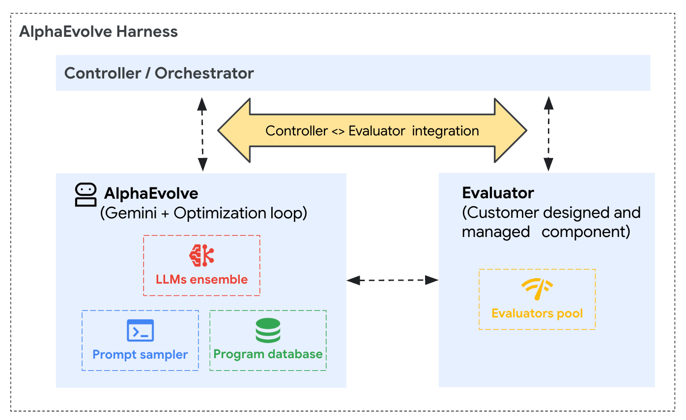

# AlphaEvolve on Google Cloud

**Discover and optimize algorithms with [AlphaEvolve](https://docs.cloud.google.com/gemini/enterprise/docs/alphaevolve/developer-guide/overview) — a Gemini-powered evolutionary coding agent, available through Gemini Enterprise and running in your own Google Cloud project.**

[](LICENSE)
[](https://www.python.org/downloads/)
[](https://docs.cloud.google.com/gemini/enterprise/docs/alphaevolve/developer-guide/overview)

<p align="center">
  
  <br><em>AlphaEvolve rewriting code as candidate solutions improve across iterations.</em>
</p>

AlphaEvolve is an evolutionary coding agent for **general-purpose algorithm discovery and
optimization**. You provide a seed program and a scoring function; AlphaEvolve uses Gemini to
propose code changes, evaluates each candidate, and evolves the population toward better
solutions over many generations.

This repository is the **client-side Python library** (`src/alpha_evolve/`) plus a set of
**runnable examples** (`examples/`) that show how to wire AlphaEvolve into real Google Cloud
environments — from a pure-Python loop with zero infrastructure to GPU training on GKE.

---

## Contents

- [Quickstart (≈5 minutes)](#quickstart-5-minutes)
- [What to expect during a run](#what-to-expect-during-a-run)
- [Results](#results)
- [How AlphaEvolve works](#how-alphaevolve-works)
- [Examples](#examples)
- [Using the `alpha_evolve` library](#using-the-alpha_evolve-library)
- [Using the AlphaEvolve Skills](#using-the-alphaevolve-skills)
- [Configuration](#configuration)
- [Repository structure](#repository-structure)
- [Cost](#cost)
- [FAQ](#faq)
- [Documentation & support](#documentation--support)
- [License](#license)

---

## Quickstart (≈5 minutes)

The **Circle Packing** example runs the full evolution loop with local Python evaluation and no
cloud infrastructure beyond the AlphaEvolve API. It's the fastest way to see the loop work.

### Prerequisites

- Python **3.9+**, [`uv`](https://docs.astral.sh/uv/), and the [`gcloud` CLI](https://cloud.google.com/sdk/docs/install)
- A Google Cloud project with **AlphaEvolve provisioned** (this gives you a Gemini Enterprise
  **App / Engine ID**). Follow the
  [Install and configure](https://docs.cloud.google.com/gemini/enterprise/docs/alphaevolve/developer-guide/get-started)
  guide once, then reuse it for every example.

### Run it

```bash
git clone https://github.com/Google-Cloud-AI/alphaevolve-on-googlecloud.git
cd alphaevolve-on-googlecloud

# Install the alpha_evolve package (from src/) with uv
uv pip install -e ".[examples]"

# Configure and run the Circle Packing example
cd examples/circle_packing
make setup      # creates .env from the template (also ensures the package is installed)
#               then edit .env and set PROJECT_ID and GE_APP_ID
make auth       # gcloud auth application-default login
make run        # start the experiment
```

`make run` uploads the seed algorithm, then evolves and evaluates candidates. You'll see each
generation's best score climb in the logs, and a `matplotlib` plot of the top packings at the
end. Run `make help` in any example to see its targets.

> Tip: set `PARALLEL_EVALUATION=True` (and `WORKER_CONCURRENCY`) in `.env` to evaluate candidates
> concurrently.

---

## What to expect during a run

Evolutionary search behaves differently from a single LLM call. Knowing this up front avoids
false alarms:

- **Progress is non-monotonic.** The best score can plateau for many generations and then jump.
  This is normal — **don't stop the run early** because the score looks stuck.
- **Invalid candidates are expected.** Programs that break constraints or fail to run return a
  sentinel score (e.g. `-inf` for an overlapping circle packing, or `neg_eval_loss = -100.0` for
  a failed training job) **plus an insight message**. Those insights are fed back to Gemini to
  steer the next generation, so failures are part of how the search improves.
- **You control the budget.** A run is bounded by `MAX_PROGRAMS_GENERATED` /
  `MAX_PROGRAMS_EVALUATED` and parallelized by `CONCURRENCY` / `WORKER_CONCURRENCY` (see
  [Configuration](#configuration)).

---

## Results

A completed run gives you back the **evolved programs** themselves: their source code,
per-candidate metric scores, and the insights that guided the search. Read the best ones back
with `experiment.list_programs(...)`. Over successive generations the search usually improves the
primary metric beyond the seed baseline; how much depends on the problem, your search budget
(`MAX_PROGRAMS_*`), and the model mixture.

Each example starts from a simple seed and evolves toward a specific target:

- **`circle_packing`** — from a concentric-ring seed, maximizes `sum_of_radii`.
- **`tsp`** — from a nearest-neighbor seed, maximizes `neg_tour_length` (shorter tours).
- **`signal_processing`** — from a moving-average seed, maximizes a multi-objective `overall_score`.
- **`llm_fine_tuning`** — from a default LoRA seed, maximizes `neg_eval_loss` (lower eval loss).

Concretely, each run produces:

- The **best evolved program** (its source code) plus per-metric scores and insights.
- **Visualizations** — e.g. `circle_packing` plots its top packings, `tsp` emits summary charts,
  and `llm_fine_tuning` writes `report/evolution_progress.png` (best-so-far score per generation)
  and `report/score_distribution.png`, plus `evolved_program/program.py` and `result.json`.

---

## How AlphaEvolve works

AlphaEvolve runs a closed evolutionary loop. The **generation** half is a managed service in
Google Cloud; the **evaluation** half is your code, running wherever you choose.

<p align="center">
  
  <br><em>Logical flow of the Cloud AlphaEvolve service. Source: <a href="https://docs.cloud.google.com/gemini/enterprise/docs/alphaevolve/developer-guide/architecture-and-workflows">Architecture and workflows</a>, Google Cloud docs (CC BY 4.0).</em>
</p>

On the cloud side, the managed service runs the evolutionary heuristic through three components,
plus the orchestration that connects them:

- **Prompt sampler** — selects and formats the prompts that steer the LLM ensemble.
- **LLM ensemble** — a configurable mixture of Gemini models that proposes new candidate programs.
- **Program database** — stores and tracks the candidate programs and their solutions.

You own the remaining piece: the **evaluator**. Scoring is domain-specific, so you write a
function that runs each candidate and returns its metrics. The `alpha_evolve` client library runs
the loop that joins the two halves:

1. **Seed program** — your starting code, with the region to evolve wrapped in
   `# EVOLVE-BLOCK-START` / `# EVOLVE-BLOCK-END` markers.
2. **Evaluator** — a deterministic function that returns one or more scores (higher = better).
3. **Controller** — `run_controller_loop()` acquires candidates from the service, runs your
   evaluator, and submits the scores and insights back. Those results land in the program
   database and shape the next generation.

Because the evaluator is _your_ code, AlphaEvolve can optimize anything you can score: pure-Python
heuristics, compiled Rust/C++, or a full model-training run. It can run locally (an `exec()`
sandbox), in a Cloud Run function, or on a GKE + Ray GPU cluster — see [Examples](#examples).

---

## Examples

Each example is self-contained; start with its `README.md`. They progress from zero
infrastructure to production GPU training.

| Example                                                                                       | What it teaches                                                                                                                                                                                                     | Evaluation runs on |
| --------------------------------------------------------------------------------------------- | ------------------------------------------------------------------------------------------------------------------------------------------------------------------------------------------------------------------- | ------------------ |
| [`circle_packing`](examples/circle_packing)                                                   | The core loop end to end (seed program, `EVOLVE-BLOCK` markers, evaluator, controller). Pack N=26 circles in a unit square to maximize summed radii.                                                                | Local `exec()`     |
| [`tsp`](examples/tsp)                                                                         | Evolve a tour-construction heuristic for the Travelling Salesman Problem (N=50), beyond nearest-neighbor.                                                                                                           | Local `exec()`     |
| [`signal_processing`](examples/signal_processing)                                             | **Multi-objective** evaluation: an adaptive time-series filter judged on 14 competing metrics across 5 non-stationary signals, with structured insights fed back to the LLM.                                        | Local `exec()`     |
| [`adaptive_sort`](examples/adaptive_sort) / [`adaptive_sort_cpp`](examples/adaptive_sort_cpp) | Evolve a **Rust** / **C++** sorting routine that adapts to data patterns, compiled and benchmarked safely in a remote function.                                                                                     | Cloud Run          |
| [`llm_fine_tuning`](examples/llm_fine_tuning)                                                 | **Production GPU infra:** evolve LoRA hyperparameters for Gemma on autoscaling **L4 GPUs** via a persistent **RayCluster on GKE**, provisioned with Terraform and observed with Ray Dashboard + Prometheus/Grafana. | GKE + Ray          |

---

## Using the `alpha_evolve` library

The public API is small. A minimal experiment looks like this (see any example's
`src/run_evolution.py` for the full version):

```python
from alpha_evolve.client import AlphaEvolveClient
from alpha_evolve.experiment import AlphaEvolveExperiment
from alpha_evolve.controller import run_controller_loop
import asyncio

# 1. Connect to AlphaEvolve in your GCP project
client = AlphaEvolveClient(
    project_id="my-project",
    location="global",
    collection="default_collection",
    engine="my-engine-id",        # your Gemini Enterprise App / Engine ID
    assistant="default_assistant",
    base_url="discoveryengine.googleapis.com",
)

# 2. Define the experiment (your evaluator returns {metric: score})
experiment = AlphaEvolveExperiment(client, my_evaluation_fn, max_programs_evaluated=10)
experiment.create_experiment({
    "title": "My Experiment",
    "problem_description": "Evolve <function> to maximize <metric>.",
    "program_language": "python",
    "run_settings": {"max_programs": 10, "concurrency": 4},
    "generation_settings": {"models": [
        {"name": "gemini-3.5-flash",       "weight": 0.7},
        {"name": "gemini-3.1-pro-preview", "weight": 0.3},
    ]},
})
experiment.create_initial_program(seed_program)
experiment.start_experiment()

# 3. Run the loop, then read back the best programs
asyncio.run(run_controller_loop(experiment))
best = experiment.list_programs(params={"order_by": "<metric> desc"})
```

Mark the code you want AlphaEvolve to rewrite:

```python
# EVOLVE-BLOCK-START
def construct_packing(n, random_seed):
    ...   # AlphaEvolve rewrites everything inside this block
# EVOLVE-BLOCK-END
```

---
## Using the AlphaEvolve Skills

The AlphaEvolve skills allow you to run AlphaEvolve experiments directly from an agentic coding assistant (e.g. Antigravity). Using these skills, your coding assistant will guide you through the entire AlphaEvolve workflow, including configuring the experiment, running the evolutionary loop, monitoring progress, and integrating the best result back into your code.

There are 6 AlphaEvolve skills included, with `README.md` and `SKILL.md` files provided for each skill.

| Skill | Role |
| --- | --- |
| [`alpha_evolve_experiment_design`](skills/alpha_evolve_experiment_design) | Scaffolds new experiments via a test-driven workflow. |
| [`alpha_evolve_runner`](skills/alpha_evolve_runner) | Configures backend requirements and launches the experiment. |
| [`alpha_evolve_monitor`](skills/alpha_evolve_monitor) | Monitors running experiments and manages the local control loop. |
| [`alpha_evolve_post_experiment`](skills/alpha_evolve_post_experiment) | Analyzes completed runs and integrates the best evolved code. |
| [`alpha_evolve_orchestrator`](skills/alpha_evolve_orchestrator) | Master workflow skill that chains the core skills end-to-end. |
| [`alpha_evolve_consultant`](skills/alpha_evolve_consultant) | Answers questions based on the expert reference guide. |

Refer to the `README.md` file in the skills folder for instructions to get started with the skills.

---

## Configuration

Every example reads settings from a `.env` file (copy from the provided `example.env`).

| Variable                                            | Description                                       | Example                          |
| --------------------------------------------------- | ------------------------------------------------- | -------------------------------- |
| `PROJECT_ID`                                        | Your Google Cloud project ID                      | `my-project`                     |
| `LOCATION`                                          | API location                                      | `global`                         |
| `COLLECTION`                                        | Discovery Engine collection                       | `default_collection`             |
| `GE_APP_ID`                                         | **Gemini Enterprise App / Engine ID** (see below) | `my-engine-id`                   |
| `ASSISTANT`                                         | Assistant ID                                      | `default_assistant`              |
| `BASE_URL`                                          | Discovery Engine endpoint                         | `discoveryengine.googleapis.com` |
| `MODEL` / `MODEL_1`,`MODEL_2` (+ `_WEIGHT`)         | Generation model(s) and mixture weights           | `gemini-3.5-flash`               |
| `MAX_PROGRAMS_GENERATED` / `MAX_PROGRAMS_EVALUATED` | Search budget                                     | `10`                             |
| `CONCURRENCY` / `WORKER_CONCURRENCY`                | Generation / evaluation parallelism               | `4`                              |
| `PARALLEL_EVALUATION`                               | Evaluate candidates concurrently                  | `True`                           |

AlphaEvolve supports two generation models: `gemini-3.5-flash` and `gemini-3.1-pro-preview`
(the latter is served from the `global` location only). You can blend them by assigning weights,
as the Circle Packing example does.

### Finding your Gemini Enterprise App ID

`GE_APP_ID` is the Engine ID of the Gemini Enterprise app created when you provision AlphaEvolve.
Find it in the Google Cloud console under your Gemini Enterprise app, or via the
[Install and configure](https://docs.cloud.google.com/gemini/enterprise/docs/alphaevolve/developer-guide/get-started) guide.

---

## Repository structure

```
src/alpha_evolve/     Client library: client, experiment, controller, workers, models, visualization
examples/
  circle_packing/     combinatorial optimization, local eval
  tsp/                TSP heuristic, local eval
  signal_processing/  multi-objective, local eval
  adaptive_sort/      evolve Rust, Cloud Run evaluator
  adaptive_sort_cpp/  evolve C++, Cloud Run evaluator
  llm_fine_tuning/    LoRA HPO on GKE + Ray (Terraform)
tests/                Unit tests for the library
bin/                  Release tooling
```

Each example follows the same shape: `program.py` (seed + `EVOLVE-BLOCK`), `evaluate.py`
(scoring), `run_evolution.py` (entry point), a `Makefile`, and an `example.env`.

---

## Cost

- **Local examples** (`circle_packing`, `tsp`, `signal_processing`) incur only AlphaEvolve /
  Gemini API usage — evaluation runs on your machine.
- **`adaptive_sort*`** adds a Cloud Run evaluator.
- **`llm_fine_tuning`** provisions GKE + L4 GPUs. Its README gives a worked estimate
  (GPU nodes autoscale to zero between runs; a ~50-evaluation experiment lands in the low
  single-digit dollars of compute — see [that README](examples/llm_fine_tuning/README.md#cost-estimate)).

AlphaEvolve and Gemini usage are billed to your Google Cloud project per your agreement. Use the
search-budget knobs (`MAX_PROGRAMS_*`, `CONCURRENCY`) to bound cost.

---

## FAQ

**Is this an open-source reimplementation of AlphaEvolve?**
No. It's a client library and examples for the **managed AlphaEvolve service** on Google Cloud,
served through Gemini Enterprise via the Discovery Engine API. Generation runs in the cloud; you
supply the seed program and the evaluator.

**How is AlphaEvolve different from a coding assistant?**
AlphaEvolve optimizes functionally-correct code against measurable metrics using evolutionary
search. It is not a general-purpose code generator and isn't meant for writing baseline code or
linting — it needs a working seed program and a scoring function.

**Which models does it use?**
AlphaEvolve uses an LLM ensemble, that is a configurable mixture of LLMs available on the Gemini
Enterprise platform. Currently available models for the mixture are Gemini — `gemini-3.5-flash`
and `gemini-3.1-pro-preview` (`gemini-3.1-pro-preview` is served from the `global` location only).

**Do I need a Gemini Enterprise license?**
Yes. Any Gemini Enterprise tier, including a trial license, grants access.

**What does it cost?**
AlphaEvolve and Gemini usage is billed to your Google Cloud project. The local examples add
nothing beyond API usage; `adaptive_sort*` adds a Cloud Run evaluator and `llm_fine_tuning` adds
GKE + GPUs. Bound cost with the search-budget settings (`MAX_PROGRAMS_*`, `CONCURRENCY`).

---

## Documentation & support

- **Overview & developer guide:** [Overview of AlphaEvolve](https://docs.cloud.google.com/gemini/enterprise/docs/alphaevolve/developer-guide/overview)
- **Get started / provisioning:** [Install and configure AlphaEvolve](https://docs.cloud.google.com/gemini/enterprise/docs/alphaevolve/developer-guide/get-started)
- **Support & feedback:** for technical issues, release questions, or feedback, contact your
  assigned Google Cloud account team.
- **Contributing:** this project is **not currently accepting external contributions**
  (see [CONTRIBUTING.md](CONTRIBUTING.md)).

## License

Licensed under the [Apache License 2.0](LICENSE).

<!--
  Suggested GitHub "About" for this repo:
  Description: "Client library and examples for running AlphaEvolve — a Gemini-powered
                evolutionary coding agent — on Google Cloud."
  Topics: alphaevolve, gemini, google-cloud, gemini-enterprise, evolutionary-algorithm,
          algorithm-discovery, llm, code-generation, discovery-engine, ray, gke, lora
-->
