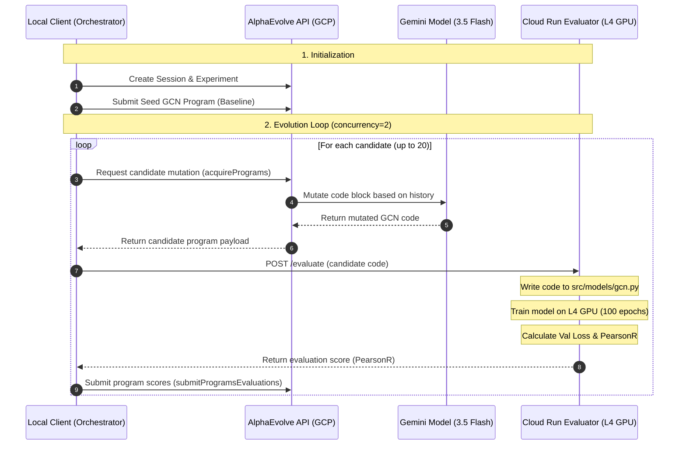
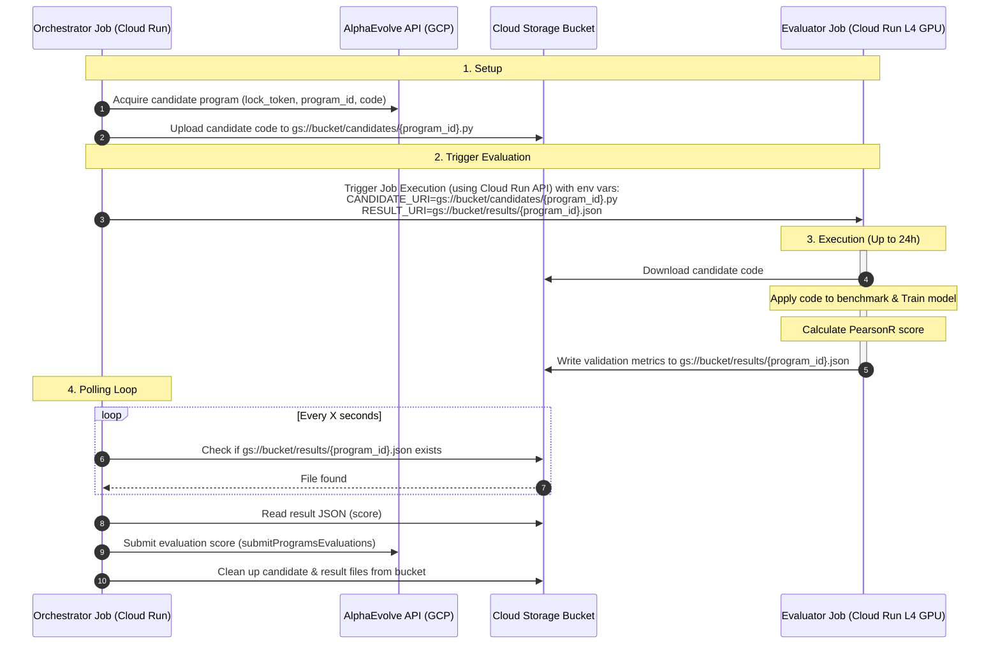
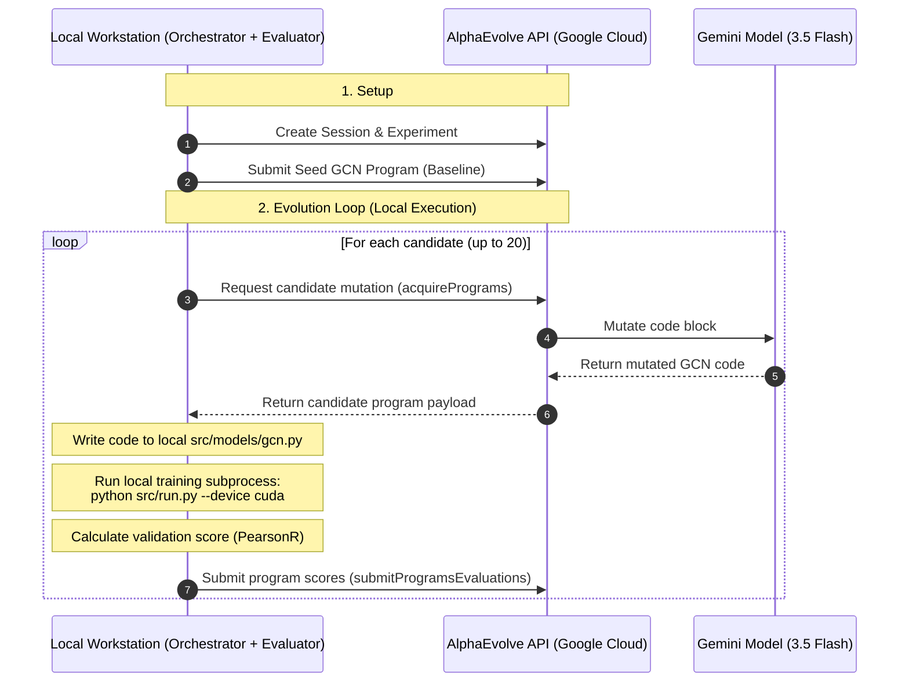
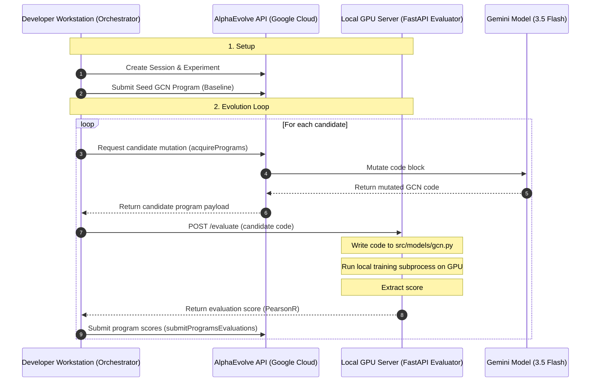

# AlphaEvolve GCN Optimization Demo

This repository demonstrates how to use **AlphaEvolve** (a Gemini-powered evolutionary coding agent on Google Cloud) to optimize a Graph Convolutional Network (GCN) model architecture for molecular property prediction.

The target task is predicting molecular solubility using the `adme_sol` dataset (regression) from the [Survey-and-Benchmarks-of-DL-for-Molecular-Property-Prediction](https://github.com/Zongru-Li/Survey-and-Benchmarks-of-DL-for-Molecular-Property-Prediction-in-the-Foundation-Model-Era.git) repository.

---

## Contents

- [Overview](#overview)
- [Architecture](#architecture)
    *   [Scaled Architecture for Long-Running Evaluations](#scaled-architecture-for-long-running-evaluations)
    *   [On-Premise Architecture Configurations](#on-premise-architecture-configurations)
- [Setup Instructions](#setup-instructions)
- [Running the Optimization](#running-the-optimization)
- [Results](#results)
- [Lessons Learned](#lessons-learned)

---

## Overview

AlphaEvolve is an evolutionary coding agent for general-purpose algorithm discovery and optimization. You provide a seed program and a scoring function; AlphaEvolve uses Gemini to propose code changes, evaluates each candidate, and evolves the population toward better solutions over many generations.

In this demo, we optimize the GCN model defined in the benchmark repository. The optimization process discovered significant improvements, increasing the PearsonR correlation from **`0.33`** (original GCN) to **`0.4324`** (evolved GCN) over 100 epochs.

---

## Architecture

This demo uses a **Split Remote Evaluation** architecture to isolate the evolutionary optimization loop from the heavy model training workloads. This allows the orchestrator to run on a lightweight local machine while offloading GPU-intensive deep learning training to Google Cloud.

### Architecture Overview



### Components

1.  **Orchestrator (`gcn_optimize_remote.py`)**: Runs locally. It initializes the AlphaEvolve session, registers the seed, coordinates candidate retrieval, submits payloads to the remote evaluator, and sends evaluation scores back to Google Cloud to update the evolutionary database.
2.  **AlphaEvolve API (Discovery Engine)**: Google-managed backend service. It maintains the database of program candidates, tracks scores, and prompts the Gemini model (`gemini-3.5-flash` or `gemini-3.1-pro-preview`) to generate optimal code mutations based on historical performance.
3.  **Evaluator Service (`evaluator_service.py`)**: A FastAPI web server deployed to Cloud Run. It exposes a single `/evaluate` endpoint. When a candidate's code is received:
    *   It dynamically writes the code to `src/models/gcn.py` inside the container.
    *   It triggers the training script (`python src/run.py`) on an **NVIDIA L4 GPU**.
    *   It parses the resulting validation loss and PearsonR correlation from the output logs and returns them.
4.  **Self-Contained Container Image**: Deployed to Cloud Run, this image is built once. To remain portable, it clones the benchmark repository directly from GitHub during image build time, installs CUDA-enabled PyTorch, PyG, DGL, and necessary libraries, and exposes the evaluator service port.

### Scaled Architecture for Long-Running Evaluations

For heavy deep learning tasks that run for hours or days, synchronous HTTP requests to Cloud Run Services will time out. The architecture below is designed for long-running, asynchronous evaluations where **both the orchestrator client and each candidate evaluation run as Cloud Run Jobs** (which support up to 24 hours of execution time and L4 GPUs).

#### Jobs-Based Architecture Diagram



#### Architectural Choices and Benefits

*   **Cloud Run Jobs for Both Orchestrator and Evaluator**:
    *   *No Timeout Limitations*: Cloud Run Services have a 60-minute limit, whereas Cloud Run Jobs support execution times up to **24 hours**. This allows large-scale models to train to convergence.
    *   *Zero Idle Billing*: Evaluator jobs run to completion and exit. You are only billed for the exact millisecond duration of the active training execution. When the job exits, billing stops immediately.
*   **Google Cloud Storage (GCS) as the Data Bridge**:
    *   *Decoupling*: The local/remote file communication is offloaded to GCS. The orchestrator doesn't need to hold open connections to the evaluator.
    *   *Payload Limits*: Passing raw code strings via API parameters can hit size limits. Storing code payloads on GCS (`gs://bucket/candidates/...`) avoids this and keeps logs clean.
*   **GCS Polling (Option B)**:
    *   *Separation of Concerns*: The evaluator remains a pure execution runner. It downloads code, runs it, and uploads the metric file to GCS. It has no knowledge of the AlphaEvolve API.
    *   *Centralized Credentials*: Only the Orchestrator Job needs permissions to speak to the AlphaEvolve backend, simplifying IAM role management and improving security.

### On-Premise Architecture Configurations

For organizations that keep data and computing resources behind a local firewall, AlphaEvolve supports running **both the orchestrator and the evaluator entirely on-premise**. 

*Note: The AlphaEvolve backend remains a managed Google Cloud service. Your local machines will require outbound HTTPS internet access to `discoveryengine.googleapis.com` (port 443).*

You can set up on-premise execution in two ways:

#### Option A: Single-Machine On-Premise (Simplest)
If you have a local GPU workstation, you can run the orchestrator loop and the model training evaluations on the **same machine**. The orchestrator invokes the evaluation logic directly as a local Python function or subprocess:



#### Option B: Distributed On-Premise (Local Network)
If your development workstation does not have a GPU, you can run the orchestrator locally and offload evaluations to a **dedicated GPU server on your local intranet**:



#### Authentication Requirements
To authorize your on-premise orchestrator to communicate with the AlphaEvolve Google Cloud API, you must configure **Application Default Credentials (ADC)** locally:

1.  Create a Service Account in your GCP project and grant it the **Discovery Engine User** role.
2.  Download the Service Account key file (`key.json`).
3.  Set the environment variable pointing to the key file on your local workstation:
    ```bash
    export GOOGLE_APPLICATION_CREDENTIALS="/path/to/key.json"
    ```

---

## Setup Instructions

### 1. Prerequisites

*   Follow the [Install and configure](https://docs.cloud.google.com/gemini/enterprise/docs/alphaevolve/developer-guide/get-started) guide to provision AlphaEvolve in your GCP project and get your **Gemini Enterprise App ID** (`GE_APP_ID`).
*   Ensure the **Artifact Registry** and **Cloud Build** APIs are enabled in your project.
*   Authenticate the `gcloud` CLI:
    ```bash
    gcloud auth login
    gcloud auth application-default login
    ```

### 2. Configure Environment

Clone this repository and create a `.env` file in the root directory (or in `examples/gcn_demo/`):

```env
PROJECT_ID=your-gcp-project-id
GE_APP_ID=your-alpha-evolve-engine-id
LOCATION=global
# EVALUATOR_URL will be set after deploying to Cloud Run
EVALUATOR_URL=https://...
```

### 3. Build and Deploy the Evaluator to Cloud Run

Navigate to `examples/gcn_demo/` and run:

1.  **Configure Docker to authenticate with Artifact Registry**:
    ```bash
    gcloud auth configure-docker us-central1-docker.pkg.dev
    ```

2.  **Submit the build to Cloud Build**:
    ```bash
    gcloud builds submit --tag us-central1-docker.pkg.dev/YOUR_PROJECT_ID/molecular-predict/gcn-evaluator:latest .
    ```

3.  **Deploy to Cloud Run with GPU**:
    ```bash
    gcloud beta run deploy gcn-evaluator \
        --image=us-central1-docker.pkg.dev/YOUR_PROJECT_ID/molecular-predict/gcn-evaluator:latest \
        --gpu=1 --gpu-type=nvidia-l4 \
        --no-cpu-throttling \
        --no-gpu-zonal-redundancy \
        --cpu=4 --memory=16Gi \
        --concurrency=1 \
        --allow-unauthenticated \
        --region=us-central1
    ```
    *Note: We use `--allow-unauthenticated` for simplicity in this demo.*

4.  **Update `.env`**: Copy the `Service URL` from the deployment output and set it as `EVALUATOR_URL` in your `.env` file (append `/evaluate` to the URL).

---

## Running the Optimization

1.  **Install the library**:
    From the repository root, install the `alpha_evolve` package in your virtual environment:
    ```bash
    pip install -e ".[examples]"
    ```

2.  **Run the evolution loop**:
    ```bash
    cd examples/gcn_demo
    python gcn_optimize_remote.py
    ```

The orchestrator will run the controller loop to evaluate 20 candidates (concurrency=2) using the remote Cloud Run GPU instances.

---

## Results

The results of the best run are saved in `examples/gcn_demo/result.md`. The evolved model introduced:
*   Multi-scale pooling (concatenating mean, max, and sum pooling).
*   Jumping Knowledge (JK) style layer aggregation (concatenating initial, middle, and last layer features).
*   GELU/SiLU activations and Layer Normalization.
*   Deeper prediction head with residual connection.

---

## Lessons Learned

When interacting with the AlphaEvolve API and running remote evaluations, keep the following lessons in mind:

### 1. OIDC Token Authentication Fallbacks
*   **The Issue**: When running orchestrator clients on GCE-hosted instances (such as Google Cloudtop VMs), the `google.oauth2` library defaults to fetching OIDC tokens from the local GCE Metadata Server. This generates a token signed for the VM's service account rather than the developer's Active Directory credentials (ADC), leading to `403 Forbidden` errors on the Cloud Run evaluator.
*   **Solution**: For development/testing, configure the Cloud Run service to allow unauthenticated access (`--allow-unauthenticated`), or explicitly grant the VM's service account the `roles/run.invoker` permission on the Cloud Run service.

### 2. Model Compatibility Constraints
*   **The Issue**: Requesting older or standard model endpoints (e.g., `gemini-1.5-flash`) via the Discovery Engine API causes an `INVALID_ARGUMENT` exception.
*   **Solution**: The AlphaEvolve engine currently only accepts modern/preview model IDs (such as `gemini-3.5-flash` or `gemini-3.1-pro-preview`).

### 3. Concurrency Safety in Cloud Run
*   **The Lesson**: Running concurrent candidate evaluations locally is prone to filesystem race conditions if multiple workers modify the same files. However, Cloud Run isolates container instances on their own ephemeral filesystems. This makes remote evaluations inherently concurrency-safe, allowing you to scale up the pacing (`concurrency` in the controller loop) without risk of state contamination.

### 4. Self-Contained Docker Builds
*   **The Lesson**: To make your remote evaluator portable, do not rely on copying local workspace directories containing target benchmarks into the container image. Instead, write the `Dockerfile` to clone the target repository directly from git during the build process, and only copy the minimal service override file (`evaluator_service.py`).

### 5. Cost Visibility and Orchestration Fees
*   **The Lesson**: The public Billing API does not expose raw spend tables via the CLI without setting up a BigQuery billing export (which is not retroactive). Additionally, AlphaEvolve charges an orchestration fee on top of base Gemini token pricing (bringing total rates to $4.50/1M input and $27.00/1M output for Flash). Monitor these rates in the Google Cloud Billing Console.
